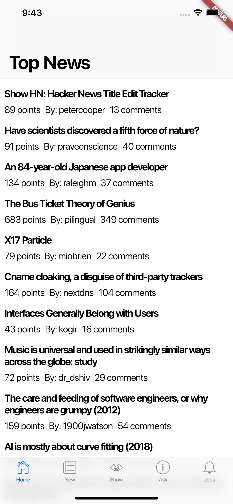
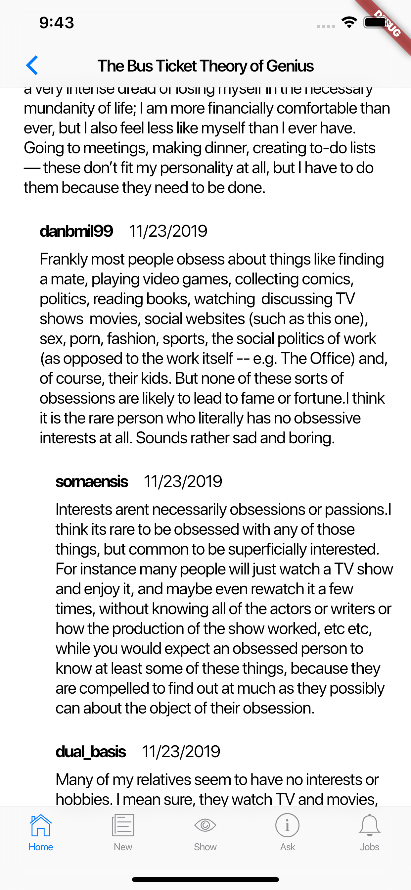

# hacker_news #

A hacker_news PWA but this time it's a mobile app.

Top stories | Comments
----------- | --------
 | 

Icon selection for the tabs is a bit poor... Yea... I still wanted to use Cupertino icons so I got creative hehe

I honestly thought there would be a briefcase icon to use for the jobs tab at least but believe it or not I was not able to find it! Neither could I find the star for the top stories, which I ended up calling home, or a question mark for the ask tab. Oh well...

## What I used for this ##

Let's make a list of all the libraries, patterns and nice stuff I wanna show off of this endeavour:

- BloC pattern implemented using the libraries `bloc` and `flutter_bloc`
- HTTP requests implemented using the `chopper` library - this allowed me to make my requests type safe
- Made all my model classes immutable and did not use `equatable` on purpose, I wanted to work with referential equality
- `get_it` for some pseudo dependency injection - this way all my services and blocs are proper singletons and I can decouple interfaces and implementations whenever I choose to do that
- I didn't really like this but I swear the alternative was worse... I made the `Stories` widget generic, also I made the `StoriesBloc` generic. This way I could make only one widget with the list and use the generic type as the parameter for requesting the BloC from GetIt. I had to go for generics because otherwise I would have had to use named instances and I could not get those to work. I did go through the stage of coding 5 components that did the same thing through a different BloC but that was embarrassing 🤭
- Since I don't display HTML I tried to remove HTML code from the text the API sent back to me... Came up with some basic regular expressions that did do the trick 90% of the times, the other 10% I decided to look away and pretend the world was perfect 🤪
